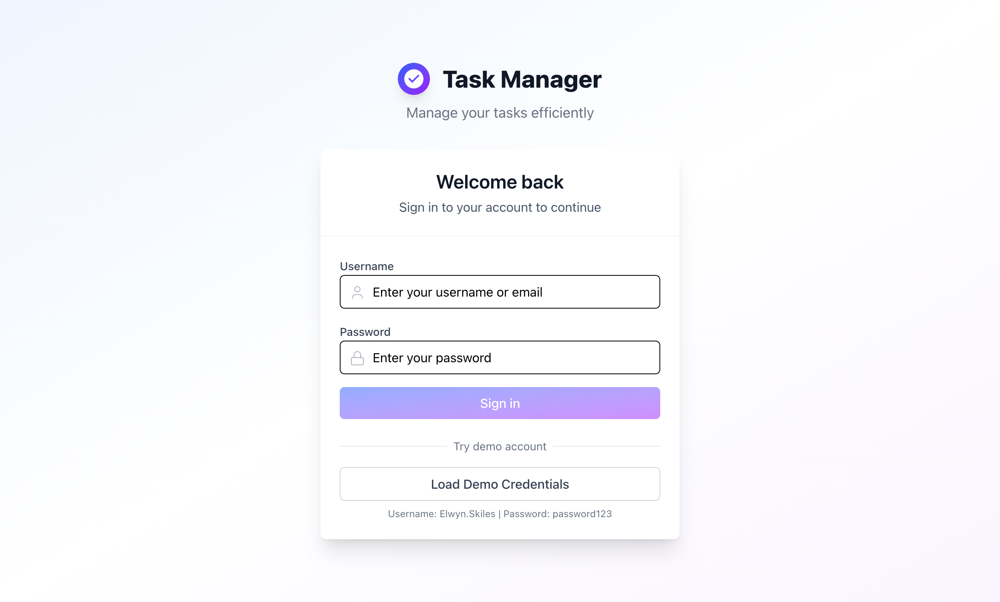
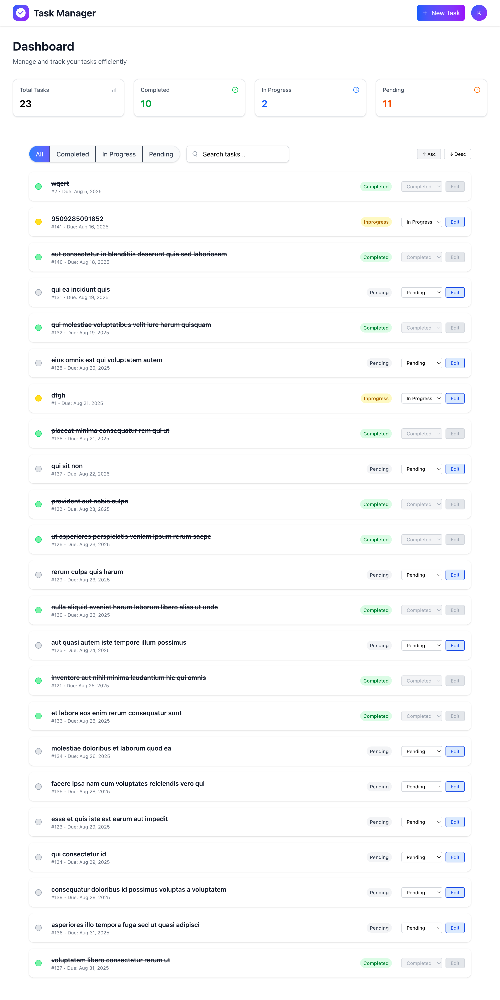

# Angular Task Manager

A simple **Task Management Application** built with **Angular** and **Tailwind CSS**.
The app enables users to create, update, search, filter, and sort tasks with a clean and responsive UI.
It follows a structured Angular architecture using **components**, **services**, and **signals** for state management.

---

## 🚀 Features

* **Task CRUD** – Add, Edit, and Delete tasks
* **Status Tracking** – Manage tasks as `Pending`, `In Progress`, or `Completed`
* **Search & Filter** – Search tasks by title or filter by status
* **Sorting** – Sort tasks by due date or task ID (ascending/descending)
* **Responsive UI** – Modern design powered by TailwindCSS

---

## 📸 Preview




---

## 🛠️ Tech Stack

* [Angular](https://angular.dev/) – Frontend framework
* [Tailwind CSS](https://tailwindcss.com/) – Styling
* [TypeScript](https://www.typescriptlang.org/) – Strongly typed JavaScript

---

## ⚙️ Installation & Setup

1. Clone the repository:

   ```bash
   git clone https://github.com/your-username/angular-task-manager.git
   cd angular-task-manager
   ```

2. Install dependencies:

   ```bash
   npm install
   ```

3. Run the development server:

   ```bash
   ng serve
   ```

4. Open your browser at:

   ```
   http://localhost:4200
   ```

---

## 📂 Project Structure

```
src/
 ├── app/
 │   ├── components/       # Reusable UI components
 │   ├── services/         # Business logic & state management
 │   ├── models/           # Interfaces & data types
 │   ├── app.component.ts  # Root component
 │   └── app.module.ts     # Main Angular module
 └── assets/               # Static files (icons, images, etc.)
```
---

## 🤝 Contributing

Contributions, issues, and feature requests are welcome.
Fork the repository and submit a pull request to improve the project.

---

## 📜 License

This project is licensed under the **MIT License** – see the [LICENSE](./LICENSE) file for details.